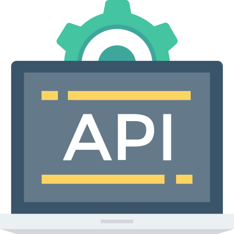

### Hi there 

My name is Abdullah Tabbal, I'm a  Front-End Software Engineer.

👨‍💻🖥️🔧 

My dream is to impact the world forever with my creations.🌎 

<a href="https://www.linkedin.com/in/abdullahtabbal/" target="_blank">
  

💡 I'm currently learning Rust! 🦀

🤝 I'm looking to connect with more developers!

🔥 My passions: Tech, Linux, coding, hiking, & animals!

📫 Reach me at: abdullahtabbal@hotmail.com

 
### 🔨 Languages and Tools:   

 

 
 
 
 
 
 
 
 
 

